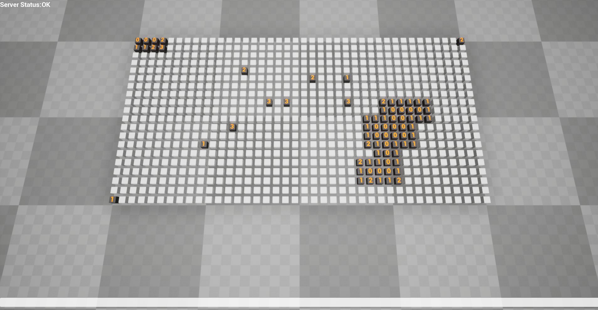
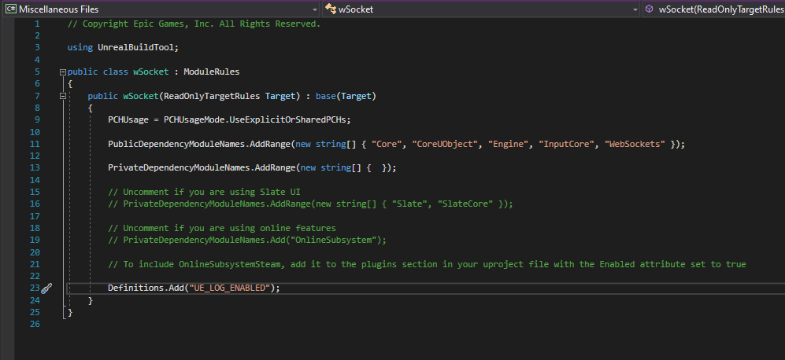
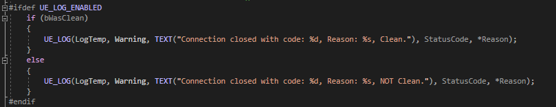
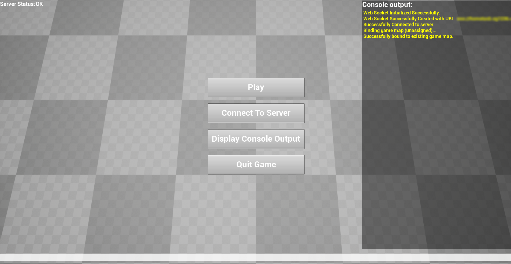
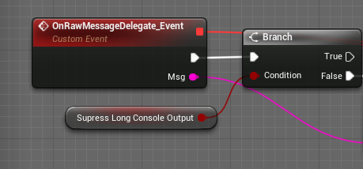
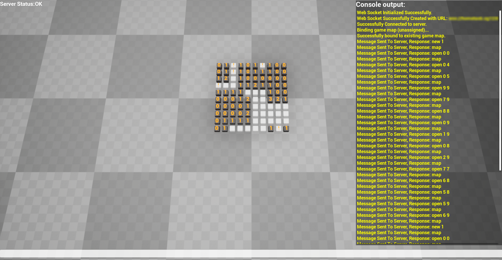
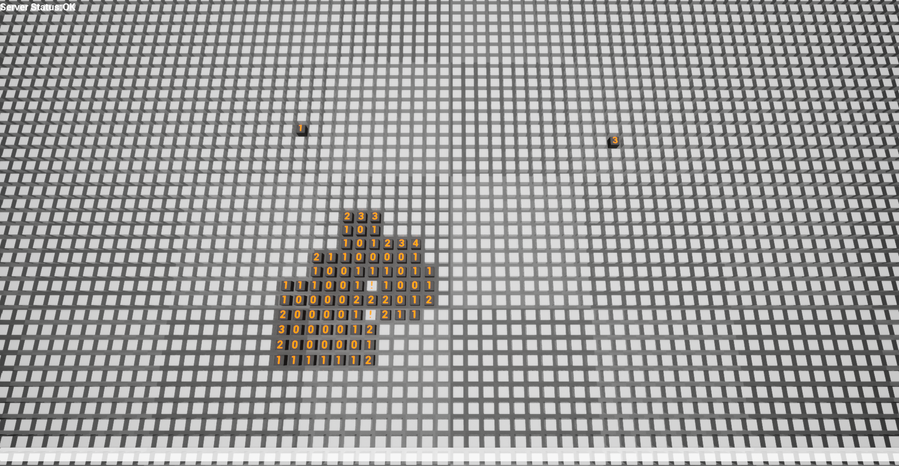

# **Web Socket Minesweeper**
A Home Task done as part of my job application

This project was created using **C++**, **Blueprints** and **Unreal Engine 4.25**. It is a WebSocket-based client for a minesweeper game server.



---
## **Project Overview**

I decided to do something interesting and swithced from traditional 2D implementation to 3D. Each grid cell is a 3D cube and it is placed by converting from traditional Top-Left to Bottom-Right screenspace coordinates to Unreal specific 3D coordinate system (left if forward, up is sideways and forward is up). Project is compact and (presumably) portable.

---
## **Prerequisites**

The project was created using:

* Unreal Engine 4.25 (Version: 4.25.4-14469661+++UE4+Release-4.25)
* Visual Studio Community 2019 (Version 16.8.2)
---
## **Configuration**
By default, some of the log lines are disabled. There are 2 layers of logging happening when the client is running: UE_LOG from C++ code and Blueprints (Debug and Dev only).

To enable logging in code, go to:
```
./Source/wSocket/wSocket.Build.cs
```
and uncomment:
```
Definitions.Add("UE_LOG_ENABLED");
```
Like so:


This will unlock pieces of code that are similar to this:


To enable log in blueprints, go to:
```
./Content/UI/MainPanel
```
And in its properties, under variables set default value of EnableMessages to true.



Additionally, you can change the value of SupressLongConsoleOutput, which will enable printout of map text into the console and log.



---

## **Implementation**
There are 3 notable C++ classes in this project: AwSocketClient, AwSocketMapCellBase and AwSocketMinesweeperPawn.

#### **AwSocketClient**
Module responsible for communication with server. Instantiates a web socket object and connects it to a specified server URL address. Also used to forward events to other modules and send data.

#### **AwSocketMapCellBase**
Actor representing a single cell on game grid. This is an interface for Blueprint implementation. Although it does have core C++ functionality to ensure it can communicate with the rest of the system.

#### **AwSocketMinesweeperPawn**
Module responsible for map generation and maintenance. Communicates both with cells and WebSocket module through Blueprint implemented UMG module.

---
## **Gameplay screenshots**




---
## **Notes**

During gameplay, WASD or arrow keys can be used to move camera around game field.

Larger fields affect performance.

I did run into crashes a few times when using Development build configuration in editor, but I was not able to reproduce, nor did debugging show any signs of issues. Project was tested and packaged on Windows 10 64-bit.

---
## **Comments**

Map module is implemented using serial approach. This has impact on performance. Multithreaded and/or data-oriented approach should be used to optimize performance. However, this was not required and would have taken more time to implement.